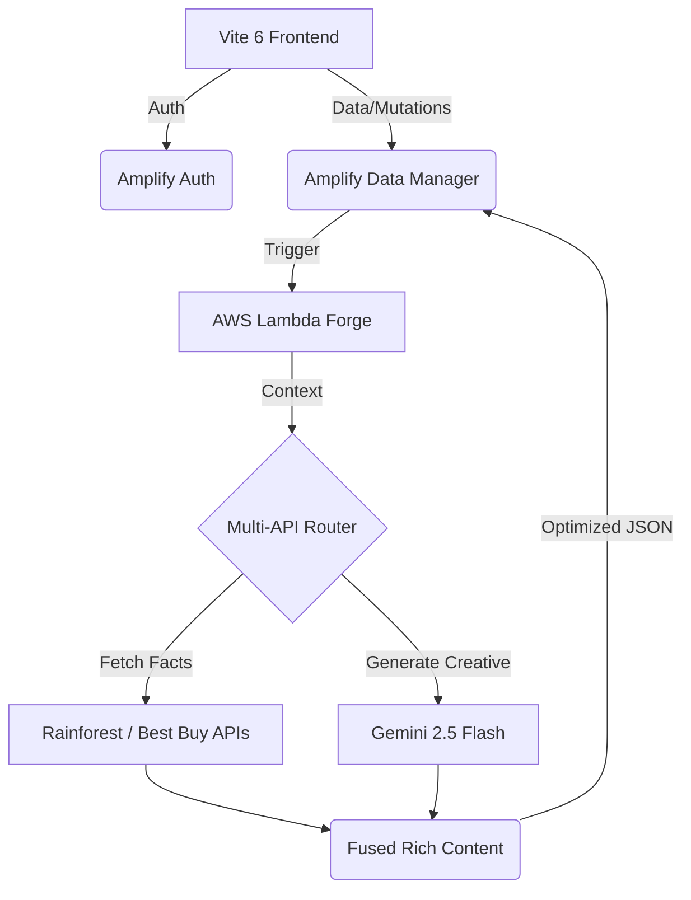

# 🤖 Auto-Niche: AI-Driven Affiliate Micro-SaaS
> **The future of affiliate marketing: Fusing Gemini 2.x creativity with real-time retailer intelligence.**

[](https://docs.amplify.aws/nextjs/start/quickstart/nextjs-app-router-client-components/)
[](https://aistudio.google.com/app/prompts/new)
[](https://vitejs.dev/)
[](https://tailwindcss.com/)

---

## ✨ Features


- **📈 Real Price Tracking**: Live 1:1 price tracking with historical delta visualization (Keepa-style).
- **🌪️ AI Forge**: High-fidelity product review generation using **Gemini 2.5 Flash**.
- **🔌 Multi-API Fusion**: Automated data fetching from **Rainforest (Amazon)** and **Best Buy** for factual accuracy.
- **💎 Premium UI**: A high-contrast, research-backed interface featuring Glassmorphism and responsive data charts.

---

## 🏗️ Architecture



---

## 🛠️ Tech Stack

- **Core**: React 19 + TypeScript + Vite 6
- **Backend**: AWS Amplify Gen 2 (AppSync, Lambda, DynamoDB)
- **AI**: Google Generative AI (Gemini 2.5/2.0 family)
- **Data APIs**: Rainforest API (Amazon), Best Buy Developer API
- **Styling**: Tailwind CSS 4 + Lucide Icons + Recharts

---

## 🚀 Getting Started

### 1. Prerequisites
- [Node.js 20+](https://nodejs.org/)
- [AWS Account](https://aws.amazon.com/)
- [Google AI Studio Key](https://aistudio.google.com/app/apikey)

### 2. Installation
```bash
git clone https://github.com/Axelfernandes/affiliate_app_amazon.git
cd affiliate_app_amazon
npm install
```

### 3. Environment Setup
Create a `.env` file based on the template:
```bash
cp .env.example .env
# Fill in your API keys
```

### 4. Development
```bash
# Terminal 1: Start Amplify Sandbox
npx ampx sandbox

# Terminal 2: Start Vite Dev Server
npm run dev
```

---

## ☁️ Deployment

Auto-Niche is built for **AWS Amplify Gen 2**. Follow these steps to launch your production instance:

### 1. Push to GitHub
Ensure all your changes are pushed to your repository:
```bash
git add .
git commit -m "Ready for production"
git push origin main
```

### 2. Connect to AWS Amplify
1. Navigate to the [AWS Amplify Console](https://console.aws.amazon.com/amplify).
2. Click **Create new app** or **All apps > New app**.
3. Select **GitHub** as the source and select your `affiliate_app_amazon` repository.
4. Choose the **Gen 2** deployment method.

### 3. Configure Secrets (CRITICAL)
Your Lambda functions require API keys to function. In the AWS Amplify Console:
1. Go to **App Settings > Environment variables**.
2. Add the following keys:
   - `GEMINI_API_KEY`: Your Google AI Studio key.
   - `RAINFOREST_API_AMAZON`: Your Rainforest API key.
   - `BEST_BUY_API_KEY`: Your Best Buy Developer key.
3. *Alternatively*, use the CLI to set secrets before the first build:
   ```bash
   npx ampx sandbox secret set GEMINI_API_KEY
   ```

### 4. Deploy
Amplify will automatically detect your `amplify` folder and start the provisioning, building, and deploying process. Once finished, you'll receive a production URL.

---

## ⚖️ License
Released under the MIT License. Built with ❤️ by Axel
