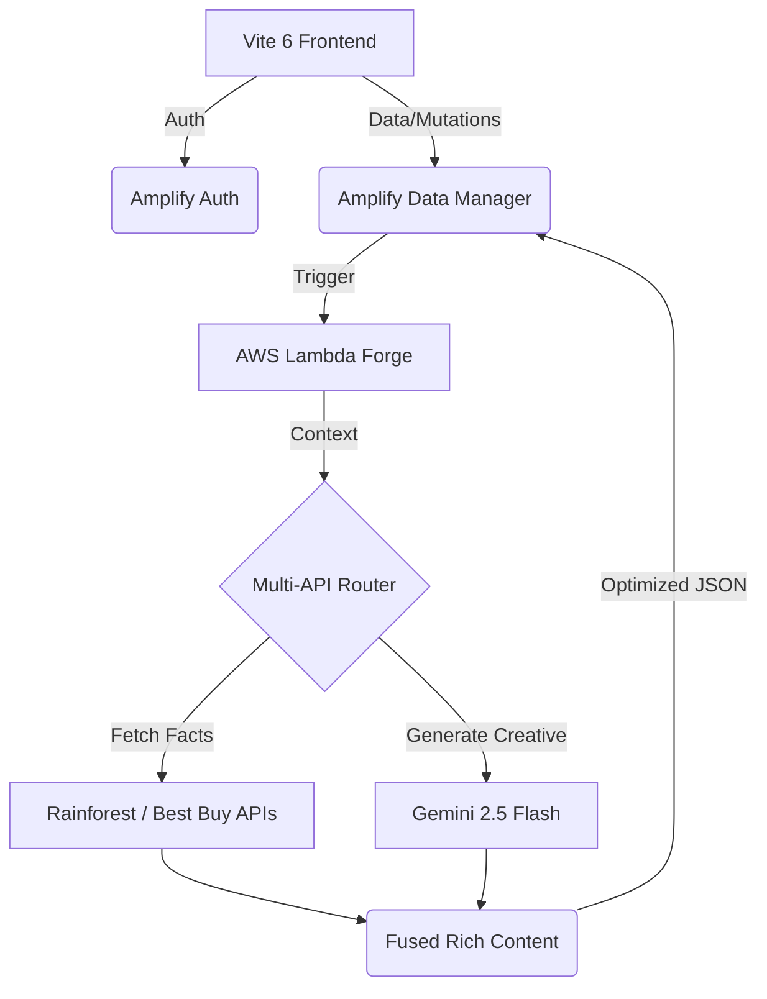

# 🤖 Auto-Niche: AI-Driven Affiliate Micro-SaaS
> **The future of affiliate marketing: Fusing Gemini 2.x creativity with real-time retailer intelligence.**

[](https://docs.amplify.aws/nextjs/start/quickstart/nextjs-app-router-client-components/)
[](https://aistudio.google.com/app/prompts/new)
[](https://vitejs.dev/)
[](https://tailwindcss.com/)

---

## ✨ Features

- **🛡️ Secret Guard**: Native Husky + Git hooks integration to prevent sensitive `.env` leaks.
- **📈 Real Price Tracking**: Live 1:1 price tracking with historical delta visualization (Keepa-style).
- **🌪️ AI Forge**: High-fidelity product review generation using **Gemini 2.5 Flash**.
- **🔌 Multi-API Fusion**: Automated data fetching from **Rainforest (Amazon)** and **Best Buy** for factual accuracy.
- **💎 Premium UI**: A high-contrast, research-backed interface featuring Glassmorphism and responsive data charts.

---

## 🏗️ Architecture



---

## 🛠️ Tech Stack

- **Core**: React 19 + TypeScript + Vite 6
- **Backend**: AWS Amplify Gen 2 (AppSync, Lambda, DynamoDB)
- **AI**: Google Generative AI (Gemini 2.5/2.0 family)
- **Data APIs**: Rainforest API (Amazon), Best Buy Developer API
- **Styling**: Tailwind CSS 4 + Lucide Icons + Recharts

---

## 🚀 Getting Started

### 1. Prerequisites
- [Node.js 20+](https://nodejs.org/)
- [AWS Account](https://aws.amazon.com/)
- [Google AI Studio Key](https://aistudio.google.com/app/apikey)

### 2. Installation
```bash
git clone https://github.com/Axelfernandes/affiliate_app_amazon.git
cd affiliate_app_amazon
npm install
```

### 3. Environment Setup
Create a `.env` file based on the template:
```bash
cp .env.example .env
# Fill in your API keys
```

### 4. Development
```bash
# Terminal 1: Start Amplify Sandbox
npx ampx sandbox

# Terminal 2: Start Vite Dev Server
npm run dev
```

---

## ⚖️ License
Released under the MIT License. Built with ❤️ by Antigravity.
